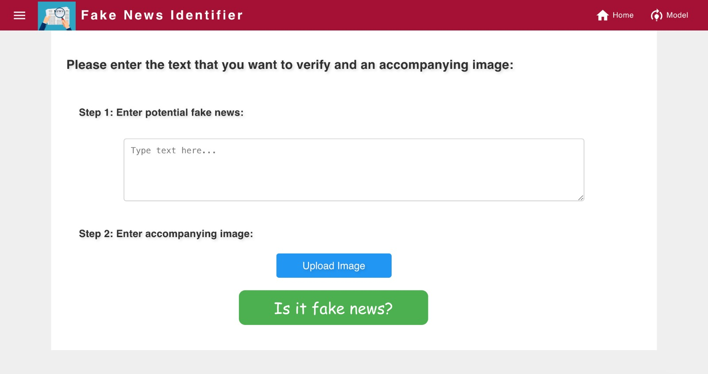
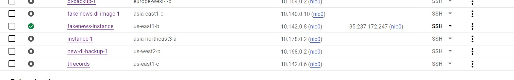

AC215 - Multimodal Fake News Detector
==============================
### Presentation  Video
* Welcome to watch our short demo in [YouTube](https://www.youtube.com/watch?v=M-FCuTmZHN4)!

### Blog Post Link
* Please refer to our Medium post [here](https://medium.com/@qassigaba/6f00526a28cd)!
---


Project Organization
------------
```
├── LICENSE
├── .gitignore
├── notebooks
├── .gitattributes
├── reports
├── README.md
├── .github/workflows         
│   ├── ci-cd.yml
├── references                  <- Reference materials such as papers
├── presentations               <- Folder containing our midterm presentation
│   └── midterm.pdf
├── requirements.txt
├── src
│   └── preprocessing            <- Code for data processing. See previous milestone for content details.
│       └── Dockerfile
            ├── data_loader.py
            ├── process.py
            ├── requirements.txt
            ├── docker-entrypoint.sh
            ├── docker-shell.sh
            ├── Pipfile
            └── Pipfile.lock
│   ├── model_compression        <- Code for model compression to ensure efficient run. See previous milestone for content details
        └── Dockerfile
            ├── docker-entrypoint.sh
            ├── downsize_model.py
            ├── model_helpers.py
            ├── requirements.txt
            └── run_docker.sh
    └── training                 <- Entire code for model training. 
        └── package (not finally used)
            │       ├── trainer
            │       │     └── multimodal_binary_training.py
            │       ├── PKG-INFO.txt
            │       ├── setup.cfg
            │       └── setup.py
            ├── Dockerfile
            ├── cli.py (not finally used)
            ├── cli.sh (not finally used)
            ├── multimodal_binary_training.py
            ├── docker-entrypoint.sh 
            ├── docker-shell.sh 
            ├── requirements.txt
            ├── train_cli_example_input.json
            └── run_docker.sh
│   ├── workflow                 <- Scripts for automating data collection, preprocessing, modeling. See previous milestone for content details   
        ├── Dockerfile
        ├── Pipfile
        ├── Pipfile.lock
        ├── cli.py
        ├── compress.yaml
        ├── docker-entrypoint.sh
        ├── docker-shell.sh
        ├── download.yaml
        ├── model.py
        ├── pipeline.yaml
        ├── sample-pipeline1.yaml
        └── train.yaml    
│   ├── api-service              <- Code for app backend APIs
│   │   ├── api
│   │   ├── Dockerfile
│   │   ├── docker-entrypoint.sh
│   │   ├── requirements.txt
│   │   ├── run_docker.sh
│   ├── frontend-react           <- Code for App frontend
│   │   ├── conf/conf.d
│   │   │   ├── default.conf
│   │   ├── public
│   │   │   ├── favicon.ico
│   │   │   ├── index.html
│   │   │   ├── manifest.json
│   │   ├── src
│   │   │   ├── app
│   │   │   ├── common
│   │   │   ├── components
│   │   │   ├── services
│   │   │   ├── index.css
│   │   │   ├── index.js
│   │   ├── .env.development
│   │   ├── .env.production
│   │   ├── .eslintcache
│   │   ├── .gitignore
│   │   ├── Dockerfile
│   │   ├── Dockerfile.dev
│   │   ├── docker-shell.bat
│   │   ├── docker-shell.sh
│   │   ├── package.json
│   │   ├── yarn.lock
├── deployment                  <- Code for app deployment to GCP
│   ├── deploy-create-instance.yml
│   ├── deploy-docker-images.yml
│   ├── deploy-provision-instance.yml
│   ├── deploy-setup-containers.yml
│   ├── deploy-setup-webserver.yml
│   ├── inventory.yml
│   ├── Dockerfile
│   ├── docker-entrypoint.sh
│   └── docker-shell.sh
│   └── nginx-conf/nginx

```
    
--------

# AC215 - Final Project

**Team Members**
Kyle Ke, Boshen Yan, Fuchen Li, Zihan Wang, Qassi Gaba

**Group Name**
TBD_1

**Project - Problem Definition**
In this project we aim to design and deploy a model that detects fake content when provided with both text and images as inputs. The underlying logic for multi-modality is that using both text and image data, instead of only text like most current models, enhances the model’s ability to discern fake content by providing additional contextual information.


## Data Description 

We utilize the Fakeddit dataset, compiled by Nakamura, Levy, and Wang in 2020, to train, validate and test our model. This dataset comprises over a million textual samples categorized into six groups: “True,” “Satire,” “Misleading Content,” “Manipulated Content,” “False Connection,” or “Imposter Content.” Notably, 682,996 samples are multimodal, featuring both text and associated images. The dataset details are shown in Table 1. Given its substantial size and its ability to represent short-form content often found on the web, we considered this dataset an excellent starting point for training an effective fake news detector. 


However, it’s important to acknowledge a limitation: all samples were derived from a single source (Reddit) over three years ago, raising the possibility of significant data drift that could impact model accuracy.

## Proposed Solution

After completions of building a robust ML Pipeline in our previous milestones, we have constructed a backend api service and frontend app. This will be our user-facing application that ties together the various components such as MLOps, scalable infrastructure, and full-stack deployment.

**APP: Multimodal Fake News Detector**

A user friendly React app was built to identify the truth of some news using a multimodel (ResNet-50 for image encoder; DisillBert for text encoder) from the GCP backend. Using the app, a user can take a picture of the news and upload the corresponding news description. The app will send the both information to the backend api, generate image and text embeddings and get prediction results on weather the news is fake or not.

Here are some screenshots of our app:



### Application Design

Before we start implementing the app we built a detailed design document outlining the application’s architecture. We built a Solution Architecture abd Technical Architecture to ensure all our components work together.

Here is our Solution Architecture:


*Figure 1: Solution architecture of project*


Here is our Technical Architecture:

*Figure 2: Technical architecture of project*

**Kubernetes Deployment**

We implemented our frontend and backend with Vertex AI Pipelines (Kubeflow) and Cloud Functions Integration, ensuring efficient load balancing and failover handling. The creation and maintenance of the Kubeflow are managed through Ansible scripts. Utilizing Ansible for infrastructure as code is beneficial for maintaining our application's infrastructure on GitHub. This approach significantly streamlines the setup of deployments, enabling high automation.

Here is our deployed app in GCP:



### Code Structure

The following are the folders for all milestones:
```
- api_service       <- Code for app backend APIs
- deployment        <- Code for K8s app deployment to GCP
- frontend-react    <- Code for App frontend
- preprocessing     <- Code for data processing. 
- model_compression <- Code for model compression to ensure efficient run. 
- training          <- Entire code for model training.
- workflow          <- Scripts for automating data collection, preprocessing, modeling.

```

**API Service Container**
: This container has all the python files to run and expose the backend apis.

To run the container locally:
- Open a terminal and go to the location where `AC215_TBD_1/src/api-service`
- Run `sh docker-shell.sh`
- Once inside the docker container run `uvicorn_server`
- To view and test APIs go to `http://localhost:9000/docs`

**Frontend Container**
: This container contains all the files to develop and build a react app. There are dockerfiles for both development and production.

To run the container locally:
- Open a terminal and go to the location where `AC215_TBD_1/src/frontend`
- Run `sh docker-shell.sh`
- If running the container for the first time, run `yarn install`
- Once inside the docker container run `yarn start`
- Go to `http://localhost:3000` to access the app locally


**Deployment Container**
: This container helps manage building and deploying all our app containers. The deployment is to GCP and all docker images go to Google Container Registry (GCR). 

To run the container locally:
- Open a terminal and go to the location where `AC215_TBD_1/src/deployment`
- Run `sh docker-shell.sh`
- Build and Push Docker Containers to GCR

```
ansible-playbook deploy-docker-images.yml -i inventory.yml
```

- Create Compute Instance (VM) Server in GCP
```
ansible-playbook deploy-create-instance.yml -i inventory.yml --extra-vars cluster_state=present
```

- Provision Compute Instance in GCP
Install and setup all the required things for deployment.
```
ansible-playbook deploy-provision-instance.yml -i inventory.yml
```

- Setup Docker Containers in the  Compute Instance
```
ansible-playbook deploy-setup-containers.yml -i inventory.yml
```

- Setup Webserver on the Compute Instance
```
ansible-playbook deploy-setup-webserver.yml -i inventory.yml
```
Once the command runs go to `http://<External IP>/` 


### Deploy using GitHub Actions

Finally we added CI/CD using GitHub Actions, such that we can trigger deployment or any other pipeline using GitHub Events. The CI/CD runs build a deployment container and execute relevant ansible yml files so that by right new containers are pushed to gcp container registry. Our yaml file `ci-cd.yml` can be found under `.github/workflows`. 

`ci-cd.yml` - Brief description here

The CI/CD workflow can be used when:
* Rebuild API + front-end react. An example is [here](https://github.com/AndyWangSFU/AC215_TBD_1/actions/runs/7147027323/job/19465807939)
* Run Vertex AI jobs and deploy the ntire workflow (data processing, model training, api). An example is [here](https://github.com/AndyWangSFU/AC215_TBD_1/actions/runs/7174803073/job/19536935796)

---

## NOTE

**DO NOT KEEP YOUR GCP INSTANCES RUNNING**

Once you are done with taking screenshots for the milestone bring them down. 
